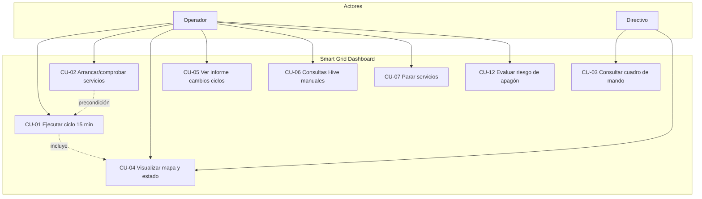
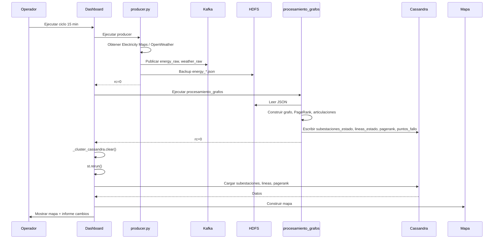
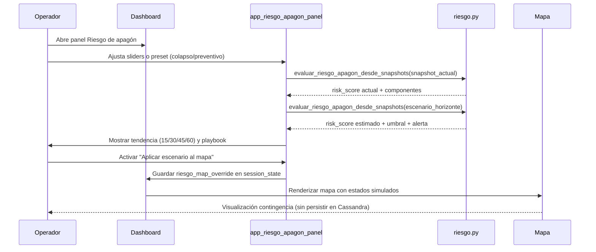
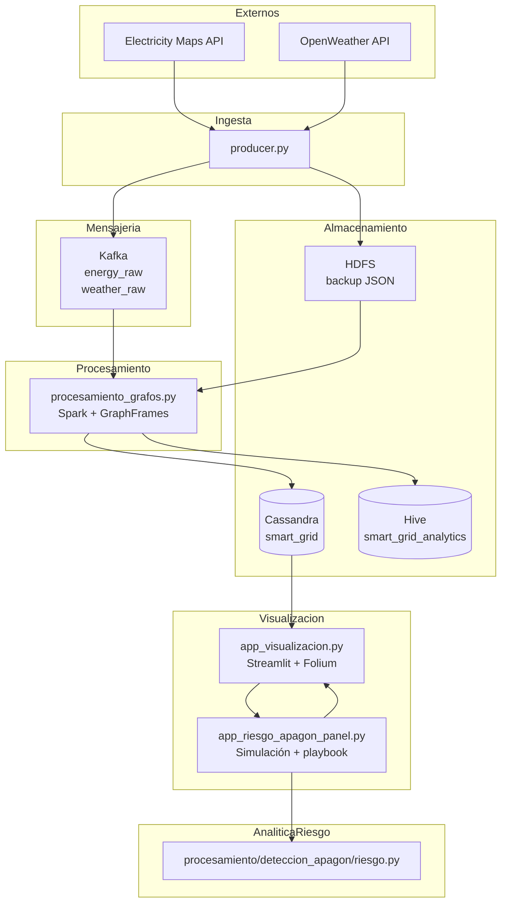
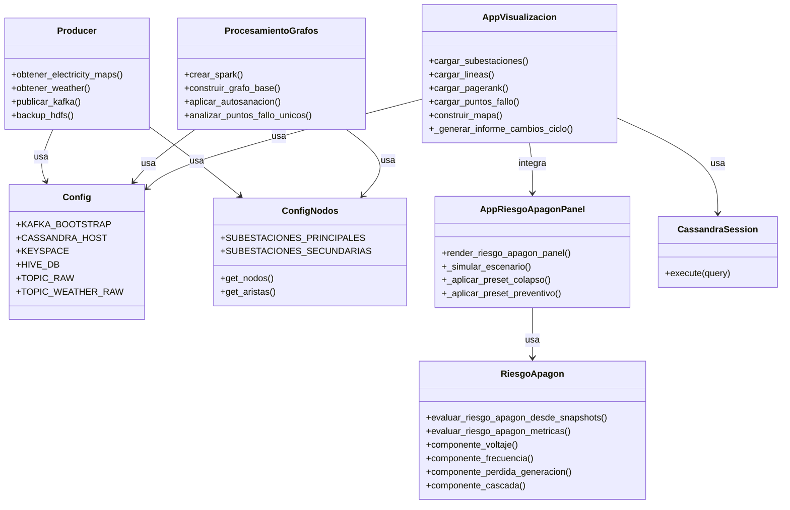
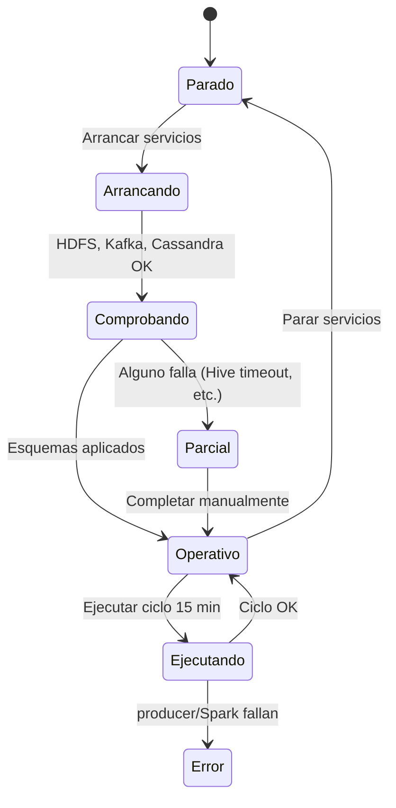
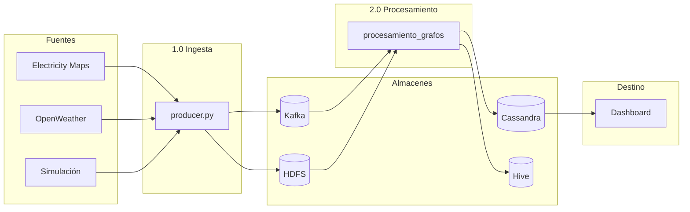
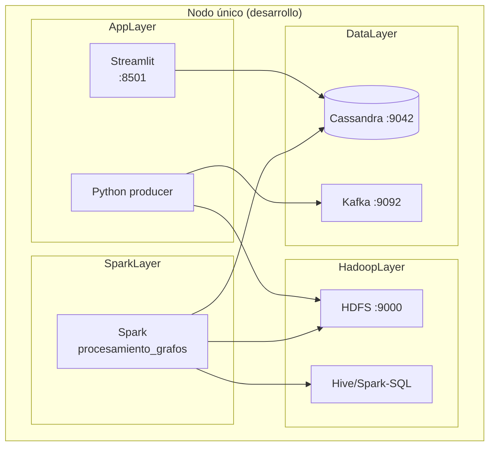
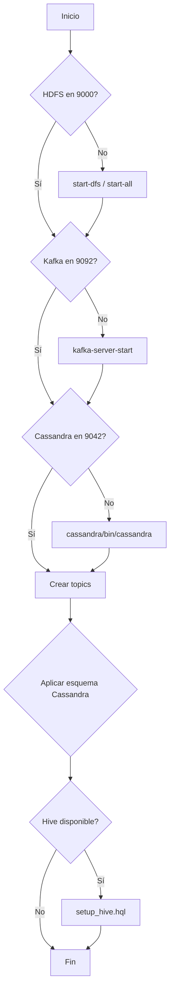

# Diagramas UML — Smart Grid España

Todos los diagramas están en sintaxis **Mermaid** y pueden visualizarse en GitHub, GitLab o editores compatibles.

---

## 1. Diagrama de casos de uso

---

## 2. Diagrama de secuencia — Ciclo 15 minutos

---

## 2.b Diagrama de secuencia — Riesgo de apagón (simulación operativa)

---

## 3. Diagrama de componentes

---

## 4. Diagrama de clases (simplificado)

---

## 5. Diagrama de estados — Servicios

---

## 6. Diagrama de flujo de datos (DFD nivel 1)

---

## 7. Diagrama de despliegue

---

## 8. Diagrama de actividad — Arranque Fase 0

